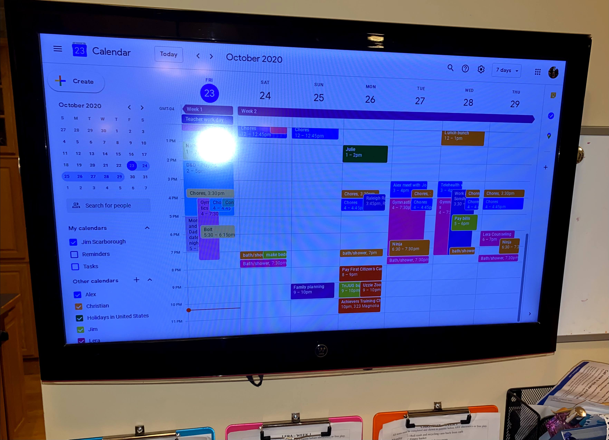

# Calendar Pi
Did you live your life near the turn of the century by a dry-erase 
calendar in the kitchen?  Do you long for more visibility into your 
Google Calendar (or perhaps other online calendar)?  Then look no
further!  The solution is here.

This setup runs **Chromium** in kiosk mode. A modern user agent string keeps
Google Calendar happy while providing full ECMAScript and CSS support.

## Ingredients
1. Raspberry Pi (I used model 3 B)
2. 2.5 A USB power supply
3. Short HDMI cable - see [photo of the back](photos/Back.jpg)
4. 32" LCD TV with HDMI input (I got one on Craigslist for $5)
5. Wall-mount for the TV (eBay and Amazon have them cheap)
6. Cheap flat USB HUB - see [photo of a mounted hub](photos/USBHub.jpg)
7. 8GB+ SD card
8. Wi-Fi or ethernet where you want the calendar
9. USB or Bluetooth Keyboard and USB mouse to help with setup
10. Double-sided foam tape or something similar
11. Small cable ties (a.k.a. zip ties) 
12. Duct tape

## Getting the Raspberry Pi ready to turn on 
1. Get the [Raspberry Pi imager](https://www.raspberrypi.org/downloads/) for a computer near you with an SD card slot.
2. Download the [Raspberry Pi OS image](https://downloads.raspberrypi.org/raspios_armhf_latest) or another supported release. Legacy images were previously recommended due to a Wi-Fi bug.
3. Use the imager to install the image to the SD card.
4. Put it all together: Connect the HDMI cable between the Pi and the TV, connect the USB hub to the Pi.
Put the SD card in the Pi, connect the power supply to the Pi, but don't plug it in yet. 
At this point, you should be able to see where the Pi will fit against the back of the TV.  Use the double-sided tape to fix the
USB hub to a back corner of the TV. Secure the cables with duct tape and cable ties. Let the Pi float, but keep it still relative
to the TV. [It might look something like this](photos/Back.jpg).  Take a look at [all the photos](photos).  The most fragile
part of this arrangement is the micro USB power connector.  Be sure the pins on the Pi aren't touching metal.
5. Power it up, plug in the keyboard and mouse to the usb hub.
6. Do the basic setup for your Pi - select language, keyboard style, time zone, password, etc., and set up the network.  You'll
use the default user "pi" to run the calendar, and this user has sudo permission by default, which will be needed.

Now select whether you want to set up from the Pi or manage from elsewhere.

## Setting up just from the Pi
8. `curl -L https://github.com/ke4roh/rpi-calendar/releases/download/v6/calendar-install-6.run | bash`

## Setting up from a remote system
11. Enable SSH on the Pi either in system preferences or by placing an empty file named `ssh` on the boot partition before first boot.
12. On the configuring machine, install Ansible (for Debian/Ubuntu: `sudo apt-get install ansible`) and clone this repo.
13. Run `ssh-copy-id pi@<pi-hostname>` to set up key-based access.
14. Copy `hosts-localhost` to a new file named `hosts` and replace `localhost` with the Pi's hostname or IP.
15. `ansible-playbook playbook.yml -i hosts -u pi`

## Finishing up
18. `reboot` the pi
19. Log in to your Google account on the Pi
20. Put a bow on it. You're done!
21. The calendar autostarts via `~/.config/lxsession/LXDE-pi/calendar.desktop`.
    Move that file to `/etc/xdg/autostart` for a system-wide setup.

## Testing
Run `make package` to build the installation archive. This step exercises the
packaging scripts and ensures everything is wired correctly.
